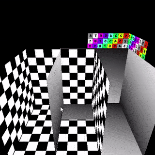

# Software-Rasterizer
SDL based software rasterizer.

## Dependencies
* SDL2 2.0.9
* stb_image

## Features
* Texture Mapping
  * Perspective Correction \
    

* Face Culling
  * Back Culling
  * Front Culling \
    

* Depth Test \
  

* Lighting
  * Phong Shading \
    
